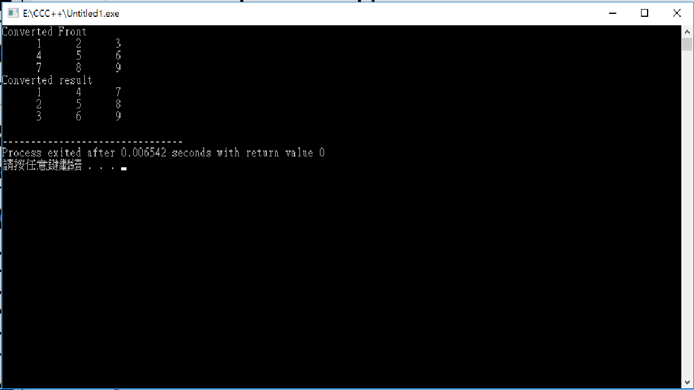

0
###### exercise1:陣列存取與基本運算
```
把一個陣列元素全部都平方存到另一個陣列
把一個陣列元素全部都反轉存到另一個陣列
改自教科書範例
```
###### exercise1:
```
#include <iostream>
using namespace std;

int main()
{
  const int NUMBER_OF_ELEMENTS = 2;
  double numbers[NUMBER_OF_ELEMENTS];
  double numbers_squared[NUMBER_OF_ELEMENTS];
  double sum = 0;

  for (int i = 0; i < NUMBER_OF_ELEMENTS; i++)
  {
    cout << "Enter a new number: ";
    cin >> numbers[i];
    sum += numbers[i];
    numbers_squared[i]=numbers[i]*numbers[i];
  }
  cout << "numbers[1] is " << numbers[1] << endl;
  cout << "numbers_squared[1] is " << numbers_squared[1] << endl;
  
  double average = sum / NUMBER_OF_ELEMENTS;

  int count = 0; // The number of elements above average
  for (int i = 0; i < NUMBER_OF_ELEMENTS; i++)
    if (numbers[i] > average)
      count++;

  cout << "Average is " << average << endl;
  cout << "Number of elements above the average " << count << endl;
  system("pause"); 
  return 0;
}


```
###### exercise1:
```


```

###### exercise2:2018.04.17
```
#include <iostream>
#include <iomanip>
using namespace std;
int fun(int array[3][3])
{
	int i,j,t;
	for(i=0;i<3;i++)
		for(j=0;j<i;j++)
		{
			t=array[i][j];
			array[i][j]=array[j][i];
			array[j][i]=t;
		}
		return 0;
}
int main()
{
	int i,j;
	int array[3][3]={{1,2,3},{4,5,6},{7,8,9}};
	cout << "Converted Front" <<endl;
	for(i=0;i<3;i++)
	{
		for(j=0;j<3;j++)
			cout << setw(7) << array[i][j] ;
		cout<< endl;
	}
	fun(array);
	cout << "Converted result" <<endl;
	for(i=0;i<3;i++)
	{
		for(j=0;j<3;j++)
			cout << setw(7) << array[i][j] ;
		cout<< endl;
	}
    return 0;
}
```

###### exercise1:
```

 

```
 ###### exercise1:
```
#include <iostream>
using namespace std;

class Circle
{
public:
  // The radius of this circle
  double radius;

  // Construct a default circle object
  Circle()
  {
    radius = 1;
  }

  // Construct a circle object
  Circle(double newRadius)
  {
    radius = newRadius;
  }

  // Return the area of this circle
  double getArea()
  {
    return radius * radius * 3.14159;
  }
};  // Must place a semicolon here

int main()
{
  Circle circle1(1.0);
  Circle circle2(25);
  Circle circle3(125);

  cout << "The area of the circle of radius "
    << circle1.radius << " is " << circle1.getArea() << endl;
  cout << "The area of the circle of radius "
    << circle2.radius << " is " << circle2.getArea() << endl;
  cout << "The area of the circle of radius "
    << circle3.radius << " is " << circle3.getArea() << endl;

  // Modify circle radius
  circle2.radius = 100;
  cout << "The area of the circle of radius "
    << circle2.radius << " is " << circle2.getArea() << endl;

  return 0;
}
```
 ###### exercise1:
```

```
 ###### exercise1:
```

```
 
